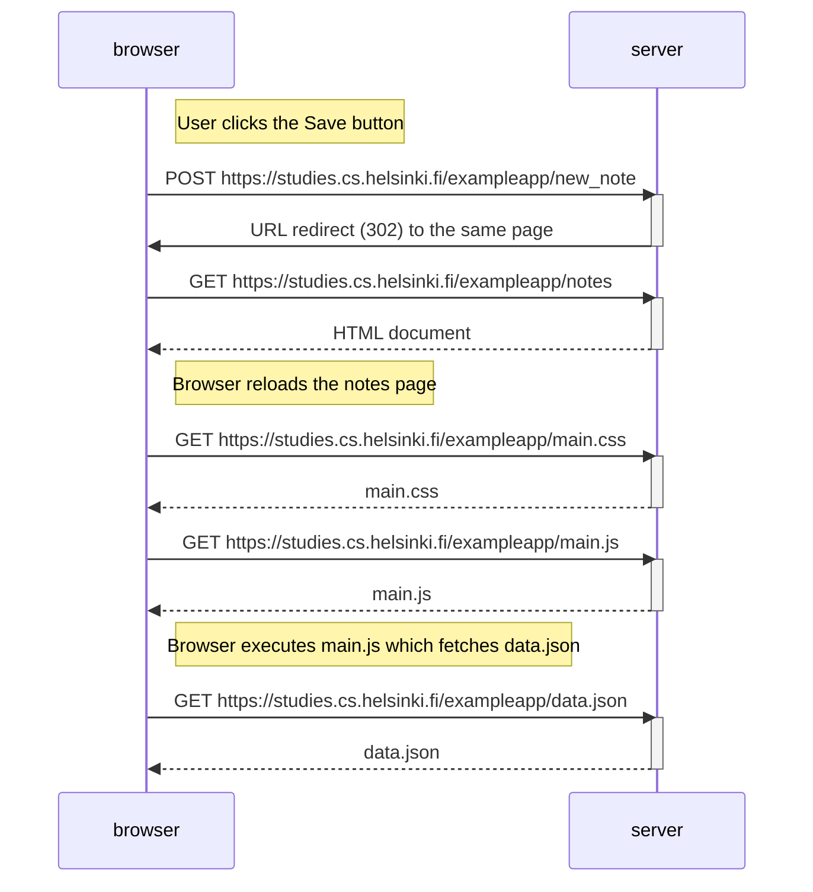

```mermaid
sequenceDiagram
    participant browser
    participant server

    Note right of browser: User clicks the Save button

    browser ->> server: POST https://studies.cs.helsinki.fi/exampleapp/new_note
    activate server
    server ->> browser: URL redirect (302) to the same page
    deactivate server

    browser ->> server: GET https://studies.cs.helsinki.fi/exampleapp/notes
    activate server
    server -->> browser: HTML document
    deactivate server

    Note right of browser: Browser reloads the notes page

    browser ->> server: GET https://studies.cs.helsinki.fi/exampleapp/main.css
    activate server
    server -->> browser: main.css
    deactivate server

    browser ->> server: GET https://studies.cs.helsinki.fi/exampleapp/main.js
    activate server
    server -->> browser: main.js
    deactivate server

    Note right of browser: Browser executes main.js which fetches data.json

    browser ->> server: GET https://studies.cs.helsinki.fi/exampleapp/data.json
    activate server
    server -->> browser: data.json
    deactivate server
```